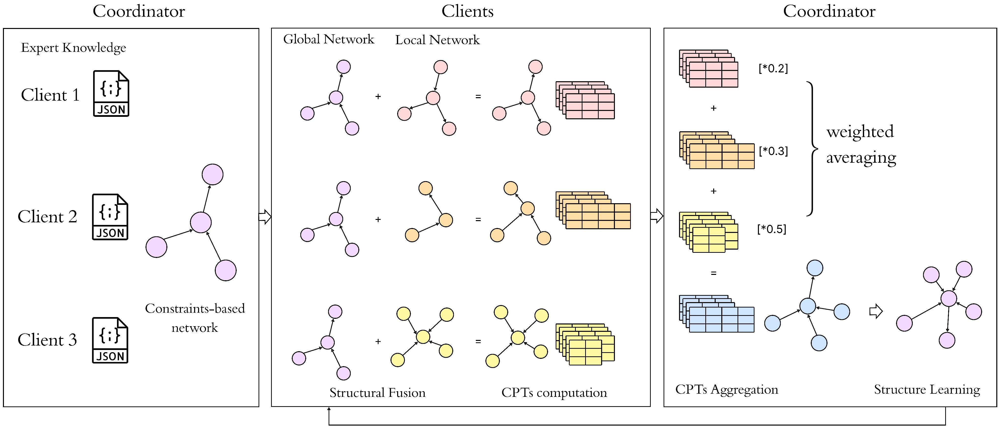

# FedBayNet
Prediction of Chronic Kidney Disease (CKD) using Bayesian Networks through Federated Learning.

## Objective
The primary objective of this project is to develop a robust predictive model for CKD by utilizing BNs to capture and model probabilistic relationships among various risk factors. To address the critical challenge of patient data privacy and scarcity in healthcare machine learning applications, the project integrates a FL approach that enables multiple healthcare institutions to collaboratively train the BN model on decentralized data. This ensures that sensitive patient data is never exposed outside the source institution, minimizing the risk of data breaches and unauthorized access. 

## Dataset
The Kaggle “Risk Factor Prediction of Chronic Kidney Disease” dataset is a medical dataset aimed at predicting the presence of CKD based on various risk factors. It includes 27 attributes drawn from patient health records, of which 11 are binary indicators (e.g., presence of hypertension, diabetes, or anemia) and 16 are categorical or interval-based variables (e.g., specific gravity of urine, serum creatinine, and age). The target variable is the class attribute, a binary indicator specifying whether the patient is affected by CKD or not.

## Project Files
This project uses Python 3.10 and requires the packages listed in the `requirements.txt` file.

To install all dependencies, run:

```bash
pip install -r requirements.txt
```

1. [Data Preprocessing and Exploratory Data Analysis](./Exploratory%20Data%20Analysis)
2. [Centralized Bayesian Networks Implementation](./Centralized%20Learning)
   ```
   cd "Centralized Learning"
   python main.py --data ../Dataset/encoded_kidney_data.csv --output Results
   ```
3. [Federated Averaging Implementation (FeatureCloud)](./fc-fedbaynet)
   - **Read Input State**: Starting from the initial state, each participant, including the coordinator, reads its private dataset, expert knowledge and a common configuration file for parameters and paths.
   - **Local Computation State**: In the 0th iteration, all the clients share their respective whitelists and blacklists with the coordinator. In the subsequent iterations, clients perform global network and data-driven network fusion
     and local CPTs computation. These CPTs are then shared with the coordinator for aggregation. 
   - **Aggregation State**: The coordinator creates an expert knowledge-based network in the 0th iteration using client consensus. In the subsequent iterations, local CPTs are aggregated and a global network is built from the aggregated
     CPTs. This structure is further refined using client consensus for edge operations.
   - **Await Aggregation State**: The participants wait for the aggregation results (updated global network) from the coordinator.
   - **Final State**: All participants and the coordinator receive the updated global CPTs and network structure.
  
   <p align="center">
   
   </p>

   
   Steps to run the app using FeatureCloud:
   ```
   cd fc-fedbaynet
   featurecloud app build
   featurecloud controller start
   ```
   After starting the controller, you can run the FedBayNet app using CLI as:
   ```
   featurecloud test start --app-image fc-fedbaynet \
   --client-dirs '[dir_name]/client1,[dir_name]/client2,[dir_name]/client3' \
   --generic-dir 'generic' \
   --download-results results
   ```
   The placeholder `dir_name` can be replaced with the following based on the associated datasets:
   - ckd_200: 200 samples,
   - ckd_200_hetero: 200 samples, non-IID data
   - ckd_400: 400 samples
   - ckd_200_hetero: 400 samples, non-IID data
